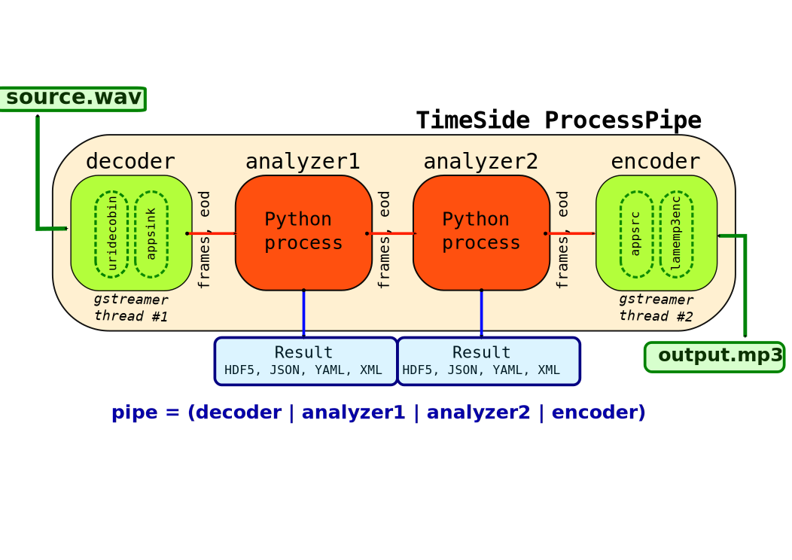

=====
Core
=====

Introduction
=============

TimeSide is a python framework enabling low and high level audio analysis, imaging, transcoding, streaming and labelling. Its high-level API is designed to enable complex processing on very large datasets of any audio or video assets with a plug-in architecture, a secure scalable backend and an extensible dynamic web frontend. Some usecases: scaled audio computing (filtering, machine learning, etc), web audio visualization, audio process prototyping, realtime and on-demand transcoding and streaming over the web, automatic segmentation and labelling synchronized with audio events

As a python module, the core module can be imported with::

  >>> import timeside.core

Because there are a lot of tools available in the Python ecosystem dedicated to music information retrieval, machine learning and data analysis, we have decided to embed all main ones: **Aubio, Yaafe, Essentia, VAMP, librosa, GStreamer, TensorFlow, Torch, PyTorch, scikit-learn, Jupyter, Pandas and Pytables**. They are used to develop native TimeSide plugins through its common and simple processing API.

The Pipe
=========

The framework is based on a streaming architecture where each audio block decoded by one ``Decoder`` will be processed by all plugins of one pipeline. Each plugin calls a ``Processor`` object which embeds common methods like ``setup``, ``pre-process``, ``process`` and ``post-process``. The resulting data can be stored and serialized in various formats.

The following diagram shows and example of a pipe.

Dive in
========

Let's produce a really simple audio analysis of an audio file.
First, list all available plugins:

.. doctest::

   >>> import timeside.core
   >>> print(timeside.core.list_processors())  # doctest: +ELLIPSIS
   IProcessor
   ==========
   ...

Define some processors:

.. doctest::

   >>> from timeside.core import get_processor
   >>> from timeside.core.tools.test_samples import samples
   >>> wavfile = samples['sweep.wav']
   >>> decoder  =  get_processor('file_decoder')(wavfile)
   >>> grapher  =  get_processor('waveform_simple')()
   >>> analyzer =  get_processor('level')()
   >>> encoder  =  get_processor('vorbis_encoder')('sweep.ogg')

Then run the *magic- pipeline:

.. doctest::

   >>> (decoder | grapher | analyzer | encoder).run()

Render the grapher results:

.. doctest::

   >>> grapher.render(output='waveform.png')

.. testcleanup::

   import os
   os.remove('waveform.png')
   os.remove('sweep.ogg')

Show the analyzer results:

.. doctest::

   >>> print 'Level:', analyzer.results  # doctest: +ELLIPSIS
   Level: {'level.max': AnalyzerResult(...), 'level.rms': AnalyzerResult(...)}

So, in only one pass, the audio file has been decoded, analyzed, graphed and transcoded.

For more examples, see :ref:`Tutorials` and other links and notebooks from the :ref:`Documentation` section.

Developing a new plugin
========================

Thanks to the plugin architecture and the *timeside* namespace, it is possible to develop your own plugin independently and outside the core module.

An extensive example of what you can do is available in the `Dummy plugin example <https://github.com/Ircam-WAM/TimeSide-Dummy.git>`_. To link it to the core, you simply need to clone it into the ``lib/plugins/`` folder like this::

    git clone https://github.com/Ircam-WAM/TimeSide-Dummy.git lib/plugins/

Then rename the plugin, code it, etc. At the next container statup, the new plugin will be loaded automatically by the core module so that you can develop it and use it out of the box::

    docker compose run app ipython
    >>> from timeside.core import get_processor
    >>> dummy_processor = get_processor("dummy")

API
===

.. toctree::
   :maxdepth: 2

   processors_list/processors_list
   decoder/index
   analyzer/index
   grapher/index
   encoder/index
   provider/index
