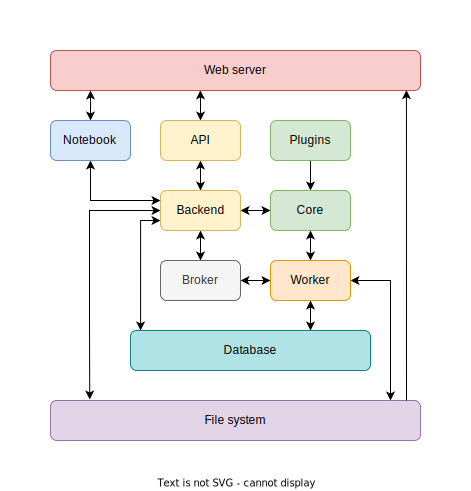
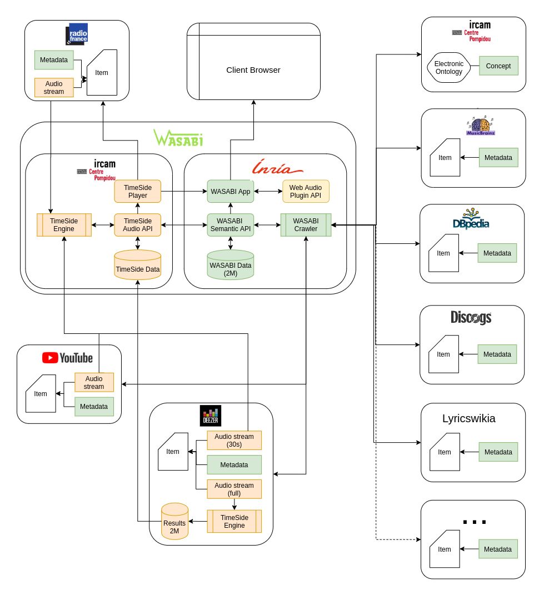

=======
Server
=======

.. toctree::
   :maxdepth: 2

Introduction
=============

In addition to be usable as a library, TimeSide has furthermore been built into a Django server with a relational PostgreSQL database in order to store music tracks and processing results. Data structure and relations are defined in the models to ensure easy data serialization. The backend is built with Django REST Framework to provide a documented RESTful API. It guarantees interoperability by allowing other servers or multiple frontends to interact with the TimeSide instance. Any application consuming the API is then able to:

- upload audio track or retrieve them from remote providers
- stream original or transcoded sources
- run on-demand analysis with customized parameters
- deliver and share several types of results: transcoded audio, numerical or graphical outputs of analysis,
- collect tags and indices on tracks to build annotated audio corpora for further machine learning purpose.

Architecture
=============

The web service are provided by a Docker composition. The following diagram shows how containers interact each other where each container is represented by a specific color. The Backend is able to delegate all the processing asynchronously to the Worker through the Broker. The Backend and the Worker share the same Core library and related plugins.

Models and Serializers
======================

The models of the backend are defined as usual Django models. Here is a non-exhaustive list of the main models:

- ``Item``: an audio resource with a source file or a URL
- ``Selection``: a list of Items
- ``Processor``: a processor provided by the core module and all related plugins
- ``Preset``: a Processor with some parameters in the JSON format
- ``Experience``: a list of Presets
- ``Task``: a list of Selection linked to an Experience to run
- ``Result``: a result of the processed Experience for an item
- ``Provider``: a web service providing audio content (e.g. Youtube or Deezer)

See `this diagram <https://github.com/Ircam-WAM/TimeSide/blob/master/docs/diagram/timeside.pdf>`_ and the `full API documentation <https://timeside.ircam.fr/api/docs/>`_ to learn all the properties and methods of these models.

This modelization allows to define a specific precessing ``Experience`` that can be re-processed on any new ``Selection`` which is especially convenient for analysis on growing datasets. All model instances and related data are accesible through a REST API with authentication. This ensures that a client can consume TimeSide as a dedicated and autonomous web service.

All the resources stored in the database are indexed with UUIDs so that any data coming from a timeside instance can be loaded any other without losing links and history. As an example, the following diagram shows how, during the `WASABI project <https://anr.fr/en/funded-projects-and-impact/funded-projects/project/funded/project/b2d9d3668f92a3b9fbbf7866072501ef-b7f7a101a0/?tx_anrprojects_funded%5Bcontroller%5D=Funded&cHash=eb348df1748631746e9b439b32e8363a>`_, some public data have been processed onto the Deezer infrastructure and then imported back into the main TimeSide database without loosing precious data linkage.

Results and Formats
====================

When an Experience has been processed on a Item, all the result data are stored on the filesystem as HDF5 files which are indexed in the database through the ``Result`` django model. As provided by the core module and explained in the :ref:`Data management` section, the data can be serialized to various formats like JSON, YAML or XML. The HDF5 file contains all the preset parameters and data structure so that, if a process is requested for the same Item, same Processor version, the data will be automatically retrieve from the database and eventualluy re-processed in another child processor or serializer.

From the server shell, a result can be retrieved like this::

   docker-compose run app python manage.py shell
   >>> from timeside.server.models import Result
   >>> from timeside.core.analyzer import AnalyzerResult
   >>> result = Result(uuid="c0a6e49e-b315-467a-8578-d42f796a197a")
   >>> data = AnalyzerResult().from_hdf5(hdf5_result)
   >>> print(data.as_dict())

To postprocess the data, see :ref:`User Interfaces`.

.. note:: When the data is requested through the API, it is automatically serialized into JSON for vectors, PNG for images and FLAC for audio.

API
===

To develop a client on top of the server, a `API full documentation is available online <https://timeside.ircam.fr/api/docs/>`_

Javascript SDK
===============

In order to build frontends on top of this web API, a `SDK is available <https://github.com/Ircam-WAM/timeside-sdk-js>`_ for Typescript and JavaScript. It has been created from the routes of the OpenAPI schema automatically exported from the backend thanks to the OpenAPI Generator. The SDK proposes  some examples for clients to reach the server and request some processing.

As an example, an augmented HTML5 player is presented in the :ref:`User Interfaces` section.

