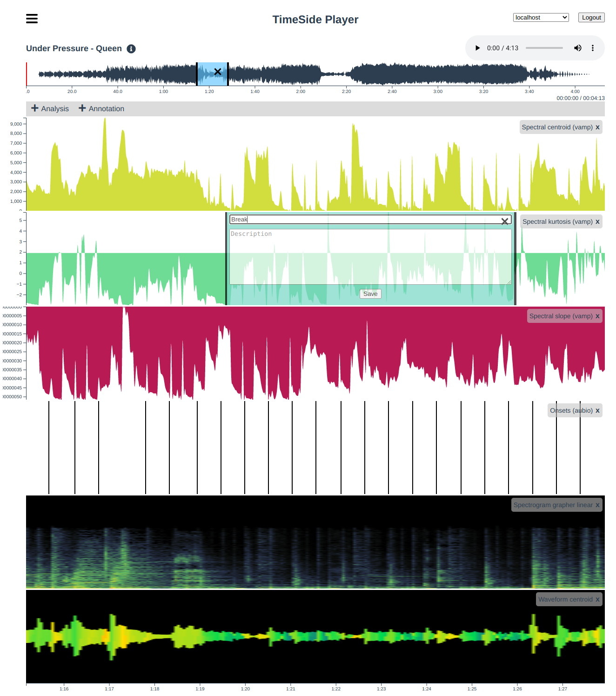

User Interfaces
===============

Ipython
-------

To run the ipython shell, just do it through the docker composition::

    docker-compose run app ipython

.. note::
  The `var/media` directory is mounted in `/srv/media` inside the container so you can use it to exchange data between the host and the app container.

Notebook
---------

You can also run your code in the wonderful `Jupyter Notebook <http://jupyter.org/>`_ which gives you a web interface to run your own code and share the results with your collaborators::

    docker-compose -f docker-compose.yml -f env/notebook.yml up

and then browse http://localhost:8888 or the URL including the login token given in the docker logs of the `notebook` container.

.. warning :: Running a Jupyter notebook server with this setup in a non-secured network is not safe. See `Running a notebook server <http://jupyter-notebook.readthedocs.org/en/latest/public_server.html/>`_ for a documented solution to this security problem.

Web Server (API)
----------------

TimeSide now includes an experimental web service with a REST API::

    git clone https://github.com/Ircam-WAM/TimeSide.git
    cd TimeSide
    docker-compose up

This will pull all needed images for running the server, initialize the database, start the server and create the test boilerplate.

You can then browse the TimeSide API at:

    http://localhost:8000/

and the admin interface (login: admin, password: admin) at:

    http://localhost:8000/admin

To run the webserver in background as a daemon, just add the `-d` option::

    docker-compose up -d

.. warning :: this is a local instance purpose only, to deploy in production see :ref:`Production`

Web Server (Shell)
------------------

To process some data by hand in the web environment context, just start a django shell session::

    docker-compose run app manage.py shell

Web player v1 (not maintained anymore)
----------------------------------------

Until 2017, TimeSide has come with a smart and pure **HTML5** audio player.

Features:

- embed it in any audio web application
- stream, playback and download various audio formats on the fly
- synchronize sound with text, bitmap and vectorial events
- seek through various semantic, analytic and time synced data
- fully skinnable with CSS style

.. image:: images/timeside_player_01.png
  :alt: TimeSide player v1

Examples of the player embeded in the Telemeta open web audio CMS:

- http://parisson.telemeta.org/archives/items/PRS_07_01_03/
- http://archives.crem-cnrs.fr/items/CNRSMH_I_1956_002_001_01/

Development documentation:

- https://github.com/Ircam-WAM/TimeSide/wiki/Ui-Guide

Web player v2
-------------

From 2021, thanks to the new RESTful API, a `new enhanced player  has been developed on top of VueJS and D3.js. It enables new strategies and usecases:

- full data streaming (audio and features)
- multi-track analysis
- multi-track collaborative annotation
- vectorized visualization
- infinite zooming
- embedded login (authentication based on JWT)

